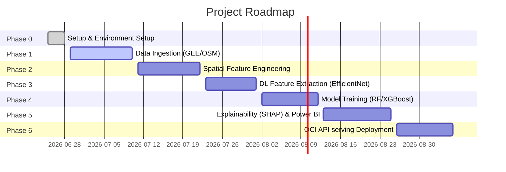

# AI-Powered Urban Growth Prediction Platform

[](LICENSE)
[](pyproject.toml)
[](pyproject.toml)

An end-to-end, industry-grade AI/ML system utilizing multi-temporal satellite imagery, infrastructure data, deep learning embeddings, and gradient-boosted models to predict and explain urban expansion trajectories between **2019 and 2026** for major metropolitan hubs (Bengaluru, Hyderabad, Pune).

---

## 📖 1. Project Overview & Context

### Problem Statement
Rapid, unplanned urbanization presents severe challenges for civil infrastructure, resource allocation, and environmental preservation. Traditional spatial forecasting relies on static, rule-based modules that fail to capture the complex, non-linear dynamics of land conversion. An industrial-scale solution requires the integration of high-resolution satellite imagery, dynamic infrastructure layers, and modern deep-learning texture representations, coupled with model transparency to inform sustainable urban planning.

### Platform Objectives
* **Data Integration**: Ingest and process Sentinel-2 and Dynamic World maps via Google Earth Engine (GEE), combined with infrastructure features from OpenStreetMap (OSM).
* **Multi-Scale Modeling**: Implement dual ML classifiers (Random Forest and XGBoost) leveraging hybrid features (tabular indices + deep learning image embeddings).
* **Deep Feature Extraction**: Employ pre-trained EfficientNet-B0 models to capture spatial context and spatial relationships from satellite chips.
* **Explainable AI (XAI)**: Render prediction metrics and local pixel-level impacts transparent using SHAP values.
* **Production Servicing**: Build a highly performant FastAPI REST endpoint deployed on Oracle Cloud Infrastructure (OCI) with Power BI interactive dashboard reporting.

---

## 🛠️ 2. Technology Stack

* **Geospatial & Cloud Data**: Google Earth Engine (GEE), OpenStreetMap (OSM) API, GeoPandas, Rasterio, Shapely
* **Deep Learning (Feature Extraction)**: PyTorch, Torchvision (EfficientNet-B0)
* **Machine Learning & Tuning**: Scikit-Learn, XGBoost, Joblib
* **Explainability (XAI)**: SHAP (Shapley Additive exPlanations)
* **API Serving**: FastAPI, Uvicorn, Pydantic (Settings)
* **Infrastructure & Deployment**: Oracle Cloud Infrastructure (OCI) Data Science, Docker, GitHub Actions (CI/CD)
* **Quality Assurance**: Pytest, Black, Flake8, MyPy, Loguru
* **Reporting**: Power BI Desktop / Service

---

## 🗂️ 3. Complete Directory Structure

Below is the directory tree of the workspace, showing the layout of the modules:

```text
Urban_Project/
├── .env.example              # Template environment file for configuration
├── .gitignore                # Rules for excluding temp, data, credential, and IDE files
├── LICENSE                   # MIT License
├── README.md                 # Project README handbook
├── config.py                 # Core configurations and auto-directory initializer
├── main.py                   # Central CLI orchestration tool
├── pyproject.toml            # Tool settings (black, isort, pytest, mypy)
├── requirements.txt          # Production runtime dependencies
├── requirements-dev.txt      # Quality assurance and local testing tools
│
├── api/                      # FastAPI implementation for REST serving
├── config/                   # Storage folder for YAML/JSON settings
├── dashboard/                # Power BI reporting files and templates
├── data/                     # Ignored data directories (except .gitkeep)
│   ├── raw/                  # Original, immutable datasets
│   │   ├── sentinel/         # Raw Sentinel-2 geotiffs
│   │   ├── dynamic_world/    # Raw Dynamic World land cover labels
│   │   └── osm/              # Raw OpenStreetMap shapefiles/geojson exports
│   ├── interim/              # Intermediate transformed outputs (pre-resampled)
│   ├── processed/            # Canonical alignment of datasets ready for feature extraction
│   ├── tiles/                # Image chips generated for deep learning input
│   └── features/             # Tabular datasets with engineered metrics & embeddings
│
├── deployment/               # Cloud configuration scripts
│   ├── docker/               # Dockerfile configurations
│   ├── oci/                  # OCI Data Science build specs and gateway profiles
│   └── ci_cd/                # CI/CD action scripts
│
├── docs/                     # Platform documentations
│   ├── architecture/         # System architecture and Mermaid flows
│   ├── api/                  # API request/response specifications
│   ├── diagrams/             # Visual design diagrams
│   ├── reports/              # Phase review documents
│   └── references/           # Peer-reviewed academic/technical resources
│
├── images/                   # Visual asset files
│   ├── architecture/         # Flowcharts & system design images
│   ├── dashboard/            # Screenshots of Power BI dashboard views
│   ├── outputs/              # Example growth maps & SHAP charts
│   └── readme/               # README banner & visual assets
│
├── artifacts/                # Persistent model and pipeline files (ignored by Git)
│   ├── models/               # Serialized RF/XGBoost binary outputs (.joblib/.json)
│   ├── scalers/              # Fitted StandardScaler / MinMaxScaler weights
│   ├── shap/                 # SHAP explainer configurations and charts
│   └── metrics/              # Validation reports and metric metrics
│
├── gee/                      # Earth Engine integration scripts
├── osm/                      # OpenStreetMap querying and parsing scripts
├── feature_engineering/      # Spatial calculation modules (NDVI, densities)
├── deep_learning/            # PyTorch models, data loaders, EfficientNet extractors
├── ml_models/                # ML training, cross-validation, and tuning routines
├── explainability/           # SHAP computation and feature-importance pipelines
├── logs/                     # Rotation log output files (platform.log)
├── notebooks/                # Jupyter Notebooks for exploratory prototyping
├── scripts/                  # Command-line utility scripts (e.g. folder setup)
└── tests/                    # Unit & Integration testing suite
```

---

## ⚡ 4. Installation & Setup Instructions

### Prerequisites
* Python 3.9, 3.10, or 3.11 installed.
* Access to a Google Earth Engine cloud project (GEE subscription / credentials).
* Oracle Cloud Infrastructure account (if deploying to OCI).

### Step 1: Clone the Repository
```bash
git clone https://github.com/your-username/Urban-Growth-Prediction.git
cd Urban-Growth-Prediction
```

### Step 2: Establish a Virtual Environment
On Windows (PowerShell):
```powershell
python -m venv .venv
.venv\Scripts\Activate.ps1
```

### Step 3: Install Dependencies
For development and test execution:
```bash
pip install --upgrade pip
pip install -r requirements-dev.txt
```

### Step 4: Configure Environment Variables
Copy `.env.example` to `.env` and fill in your actual settings:
```bash
copy .env.example .env
```

---

## 🚀 5. Running the Project

In Phase 0, you can verify your environment structure, python library dependencies, and configuration setup using the CLI tool:

### Verify Environment Setup
```bash
python main.py --verify-setup
```

### Future CLI Routing
The CLI has standard flags prepared for future orchestrations:
```text
options:
  -h, --help            show this help message and exit
  --verify-setup        Run environment diagnostics, directory existence validation, and import test validation
  --city {Bengaluru,Hyderabad,Pune}
                        Target city for actions
  --ingest-data         [Future] Trigger Google Earth Engine and OpenStreetMap download pipelines
  --process-features    [Future] Execute spatial feature engineering, calculation of indices and EfficientNet embeddings
  --train-models        [Future] Run ML training (Random Forest/XGBoost) and Deep Learning routines
  --explain             [Future] Generate SHAP value plots and feature importance reports
```

---

## 🗺️ 6. Project Roadmap & Future Phases



* **Phase 1: GEE & OSM Ingestion**: Write script logic in `gee/` and `osm/` to download multi-temporal imagery and road/building vectors.
* **Phase 2: Spatial Features**: Code calculations for indices (NDVI, NDBI, NDWI) and density surfaces under `feature_engineering/`.
* **Phase 3: Deep Feature Extraction**: Construct the PyTorch chip loader and configure the EfficientNet-B0 embedding extraction in `deep_learning/`.
* **Phase 4: ML Training**: Code model validation, hyperparameter tuning, and weight serialization in `ml_models/`.
* **Phase 5: Explainability & Dashboard**: Compute SHAP scores (`explainability/`) and link processed prediction outputs to the Power BI dashboard (`dashboard/`).
* **Phase 6: OCI API Serving**: Create FastAPI router endpoints (`api/`) and build container configs (`deployment/docker/`) for OCI cloud hosting.

---

## 📜 7. License

Distributed under the MIT License. See [LICENSE](LICENSE) for more information.

---

## 🤝 8. Contributing

1. Fork the Project.
2. Create your Feature Branch (`git checkout -b feature/AmazingFeature`).
3. Commit your Changes (`git commit -m 'Add some AmazingFeature'`).
4. Push to the Branch (`git push origin feature/AmazingFeature`).
5. Open a Pull Request.
