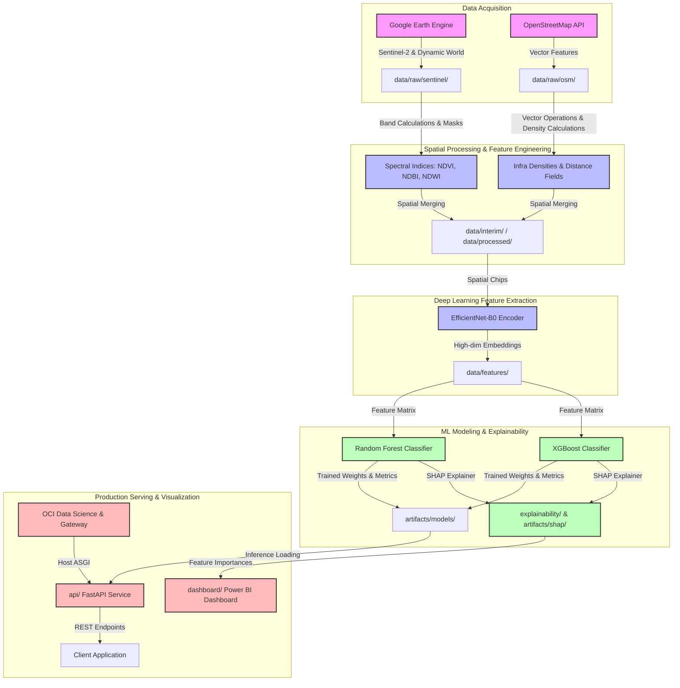

# System Architecture Specification

This document details the software architecture, data pipelines, and deployment topology of the **AI-Powered Urban Growth Prediction Platform**.

---

## 1. System Overview

The platform uses historical multi-temporal satellite imagery and OpenStreetMap infrastructure data to predict urban expansion between **2019 and 2026** for major cities (Bengaluru, Hyderabad, Pune) and generalizes to unseen locations.

---

## 2. Pipeline Stage Breakdown

### Stage 1: Data Acquisition (`gee/`, `osm/`)
* **Google Earth Engine (GEE)**:
  * Downloads temporal composites of **Sentinel-2** (10m resolution) and **Dynamic World** (land cover classifications: water, trees, grass, flooded vegetation, crops, scrub, built, bare, snow/ice).
  * Area of Interest (AOI) boundaries are defined dynamically based on urban administrative shapefiles.
* **OpenStreetMap (OSM)**:
  * Downloads vector primitives (nodes, ways, relations) representing roads, buildings, highways, and water bodies using Overpass API queries.

### Stage 2: Feature Engineering (`feature_engineering/`)
* **Spectral Indices**:
  * $NDVI = \frac{NIR - Red}{NIR + Red}$ (Vegetation indicator)
  * $NDBI = \frac{SWIR - NIR}{SWIR + NIR}$ (Built-up indicator)
  * $NDWI = \frac{Green - NIR}{Green + NIR}$ (Water surface indicator)
* **Proximity & Density Transforms**:
  * Continuous distance fields representing Euclidean/Manhattan distance to city centers, major highway networks, and primary transit corridors.
  * Spatial density calculations (e.g., Kernel Density Estimation) for buildings and roadways using projection systems (`EPSG:3857` for meters).

### Stage 3: Deep Learning Representation (`deep_learning/`)
* **EfficientNet-B0 Embeddings**:
  * The system tiles the temporal composite satellite grids into small image chips (e.g., $64 \times 64$ pixels).
  * A pre-trained **EfficientNet-B0** network acts as a frozen feature extractor, mapping spatial context into low-dimensional semantic vector embeddings (e.g., size 1280).
  * These embeddings capture texture, land configuration, and localized building pattern complexities missed by simple tabular rules.

### Stage 4: Machine Learning Classifiers (`ml_models/`)
* **Modeling Targets**:
  * Predicts the binary/multiclass probability of land transition to "Built-up" status in a future timeframe.
* **Model Choices**:
  * **Random Forest**: Established baseline robust to overfitting and highly suited for non-linear geographic spatial data.
  * **XGBoost**: High-performance gradient boosted decision trees maximizing accuracy and generalization speed.
* **Storage**:
  * Serialized models and feature normalizers are saved directly under `artifacts/models/` and `artifacts/scalers/` for reproducible deployment.

### Stage 5: Explainability Suite (`explainability/`)
* **SHAP (SHapley Additive exPlanations)**:
  * Approximates Shapley values to score local feature contributions to each urban prediction.
  * Quantifies exactly how much spatial indices (e.g., proximity to highways) versus deep learning texture embeddings influenced a specific pixel's predicted expansion.

### Stage 6: Visualization and Serving (`dashboard/`, `api/`, `deployment/`)
* **Power BI**:
  * Reads tabular outputs from processed predictions and SHAP scores, providing spatial choropleths, growth trajectories, and explainability scorecards.
* **FastAPI**:
  * Packages training prediction pipelines into endpoints enabling:
    1. City selection (pre-cached model inference).
    2. Dynamic data upload (accepting custom geotiffs and processing them on-the-fly to return predictions).
* **Oracle Cloud Infrastructure (OCI)**:
  * Containerized via Docker (`deployment/docker/`).
  * Hosted in OCI Registry (OCIR) and executed within OCI Data Science Model Deployments as a scalable REST API endpoint.
