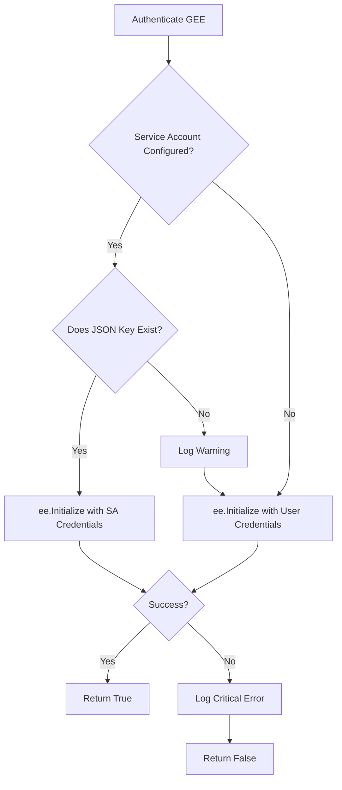

# Phase 1 Setup Report: Google Earth Engine Ingestion Pipeline

This report describes the architecture, algorithms, and configurations implemented for the Google Earth Engine (GEE) data collection pipeline, securing the foundational input layer for the **AI-Powered Urban Growth Prediction Platform**.

---

## 1. Earth Engine Authentication Flow

The GEE authentication engine in `gee/authenticate.py` implements a resilient credentials-loading chain suitable for both local development and automated server testing:



1. **Service Account Credentials**: If `GEE_SERVICE_ACCOUNT_EMAIL` and `GEE_SERVICE_ACCOUNT_KEY_PATH` are supplied in `.env` and the key file exists, the pipeline instantiates the API using server-to-server credentials. This is ideal for CI/CD runs and backend microservice hosting.
2. **User Credentials (Fallback)**: If service account settings are missing or key resolution fails, the pipeline calls default initialization, which reads active access tokens configured on the host machine via `earthengine authenticate`.

---

## 2. Sentinel-2 Dataset & Spectral Configuration

The platform queries the **Sentinel-2 Surface Reflectance (Harmonized)** collection (`COPERNICUS/S2_SR_HARMONIZED`) in Earth Engine:
* **Harmonization**: Handles the critical transition in Sentinel-2 processing baselines introduced by ESA in early 2022 (correcting band offsets to prevent data drift between 2019 and 2026 data).
* **Target Scale**: Native 10m spatial resolution.
* **CRS Target**: WGS84 projection (`EPSG:4326`) to preserve global coordinate consistency.
* **Extracted Bands**:
  * `B2` (Blue) - 10m
  * `B3` (Green) - 10m
  * `B4` (Red) - 10m
  * `B8` (Near Infrared - NIR) - 10m
  * `B11` (Shortwave Infrared 1 - SWIR1) - 20m (resampled to 10m during export)
  * `B12` (Shortwave Infrared 2 - SWIR2) - 20m (resampled to 10m during export)

---

## 3. Preprocessing: Cloud Masking & Median Composites

To ensure clean, noise-free outputs over dynamic urban regions, the pipeline applies active cloud filtering and temporal compositing:

### Advanced Combined Cloud Masking
Google recommends combining the QA60 bitmask band with the Sentinel-2 Cloud Probability dataset (`COPERNICUS/S2_CLOUD_PROBABILITY`) to catch thin cirrus clouds that QA60 alone might miss:
1. **Cloud Probability**: Each image in S2 Surface Reflectance is joined with its matching cloud probability layer using the `system:index` key. Pixels with cloud probability exceeding the configured threshold (default `60%` in `config/satellite.yaml`) are masked out.
2. **QA60 Flags**: In addition, bits 10 and 11 of the QA60 band are checked to identify clouds and cirrus, respectively.

This dual-masking approach yields clean inputs for NDVI, NDBI, and building density calculations.

### Median Composite Methodology
For each target year (2019 and 2026), all masked images in the filtered collection are aggregated using a **median composite**:
$$\text{Pixel Value} = \text{median}\left( P_1, P_2, \dots, P_n \right)$$
Where $P_i$ represents the cloud-free surface reflectance values of a single pixel location across the temporal stack. The median operation effectively filters out transient atmospheric noise, agricultural soil shifts, and shadow outliers, returning a stable seasonal representation of the urban landscape.

---

## 4. Quality Check Stage

Prior to exporting, the composite image undergoes a strict diagnostic check to prevent corrupt or incomplete geometries from propagating downstream:

* **Expected Bands Validation**: Asserts that all 6 target bands (`B2`, `B3`, `B4`, `B8`, `B11`, `B12`) are fully populated.
* **Resolution Limit**: Confirms that nominal pixel resolution matches scale targets (within range limits, e.g. 10m).
* **CRS Check**: Asserts coordinate reference system match.
* **Valid Pixel Density Ratio**:
  $$\text{Valid Pixel Ratio} = \frac{\text{Count of non-masked pixels within boundary}}{\text{Total pixels within boundary}}$$
  If the valid pixel ratio is below the configured threshold (default `30%`), the pipeline triggers warnings. This signals excessive cloud cover or boundary mismatch during GEE processing.

---

## 5. Output Organization & Deliverables

Project assets (such as city administrative boundaries) are separated from transient raw datasets:
* **Assets Location**: `assets/boundaries/{City}.geojson`
* **Raw Satellite Outputs**: `data/raw/sentinel/{City}/{Year}/`

```text
data/raw/sentinel/{City}/{Year}/
├── image.tif            # Multi-band (6 bands) uint16 GeoTIFF satellite composite
├── image_preview.png    # Natural-color (B4-B3-B2) stretched RGB preview image
└── metadata.json        # Detailed audit-trail and QC report parameters
```

### Metadata JSON Schema
```json
{
    "city": "Bengaluru",
    "year": 2019,
    "collection": "COPERNICUS/S2_SR_HARMONIZED",
    "cloud_probability_collection": "COPERNICUS/S2_CLOUD_PROBABILITY",
    "cloud_threshold_pct": 20,
    "cloud_probability_threshold": 60,
    "bands_extracted": ["B2", "B3", "B4", "B8", "B11", "B12"],
    "projection_crs": "EPSG:4326",
    "target_resolution_m": 10,
    "source_scene_count": 25,
    "quality_metrics": {
        "qc_passed": true,
        "cloud_free_pixel_ratio": 0.985,
        "approx_total_pixels": 820100,
        "approx_valid_pixels": 807800
    },
    "pipeline_version": "1.1.0",
    "git_commit": "e8a2a91",
    "generated_at": "2026-06-26T11:25:00Z",
    "execution_stats": {
        "timestamp": "2026-06-26 11:25:00",
        "processing_duration_sec": 42.15
    }
}
```
This metadata structure enables complete traceability and auditing for reproducibility before modeling.
