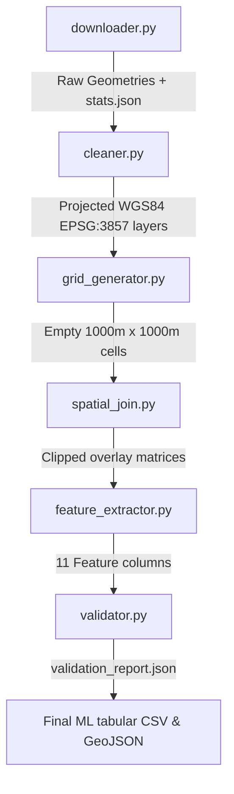

# Phase 2 Technical Report: OpenStreetMap Processing Pipeline

This technical report details the software architecture, spatial algorithms, mathematical formulas, and data validations built into the **OpenStreetMap (OSM) Processing & Feature Engineering Pipeline** of the AI-Powered Urban Growth Prediction Platform.

---

## 1. High-Level Pipeline Architecture

The pipeline is organized as six modular python files under the `osm/` package, executing sequentially. This structure decouples network queries, data sanitization, grid creation, spatial joins, feature calculations, and data validations:

---

## 2. Technical Module Specifications

### A. Downloader (`osm/downloader.py`)
* **Purpose**: Fetches vector features from Overpass API inside WGS84 coordinates.
* **Downloaded Layers**:
  - `buildings.geojson`: Extracted using `{"building": True}` tags.
  - `green_areas.geojson`: Extracted using `{"landuse": [...]}` and `{"leisure": [...]}` tags.
  - `roads.geojson` / `roads.graphml`: Road network graphs downloaded using `ox.graph_from_polygon`.
* **Output Stats**: Creates `download_statistics.json` immediately containing count of features fetched, timestamp, and versioning info.

### B. Cleaner (`osm/cleaner.py`)
* **Purpose**: Standardizes coordinate structures and repairs geometries.
* **Steps**:
  1. Fixes invalid topological shapes using Shapely's `make_valid` method.
  2. Discards empty geometries and null attributes.
  3. Re-projects layers to the metric Web Mercator projection (**`EPSG:3857`**) to support distance and area calculations in meters.
  4. Spatial clip: Truncates nodes/edges lying strictly outside the boundary envelope of the target city.

### C. Grid Generator (`osm/grid_generator.py`)
* **Purpose**: Generates a metric regular grid over the study boundary area.
* **Algorithm**:
  1. Computes the bounding envelope coordinates `[minx, miny, maxx, maxy]` of the projected boundary.
  2. Generates coordinate intervals at `grid_size_meters` (default: 1000m / 1 km) resolution.
  3. Loops coordinate intervals, instantiating square box shapes.
  4. Performs a spatial intersection check: retains a cell only if its polygon overlaps the city's administrative boundary.
  5. Assigns a sequential, unique integer index `grid_id`.

### D. Spatial Join (`osm/spatial_join.py`)
* **Purpose**: Overlays vector datasets with grid cells.
* **Overlay Clip Logic**: Instead of doing simple spatial intersects (`gpd.sjoin`) which duplicates feature measures (e.g. counting the same building or road segment in multiple grid cells), the module runs **`gpd.overlay(..., how='intersection')`**. This clips lines and polygons directly to cell borders, ensuring exact partitioning.

### E. Feature Extractor (`osm/feature_extractor.py`)
* **Purpose**: Calculates the 11-feature ML attribute dataset.
* **Automatic City Center Detection**: Avoids hardcoded coordinates. It automatically resolves the city centroid by calculating the `representative_point()` of the projected administrative boundary. This centroid calculation is guaranteed to land inside the polygon.
* **Highway Distance Mapping**: Uses `gpd.sjoin_nearest` to map cell centroids to the closest major road classified in `Config.OSM_MAJOR_HIGHWAYS`.

### F. Validator (`osm/validator.py`)
* **Purpose**: Assures output data integrity.
* **Checks Executed**:
  - Assert zero-area cell errors.
  - Assert negative metrics (densities, counts, lengths).
  - Assert ratio columns (ratios must fall inside `[0.0, 1.0]`).
  - Assert no duplicate grid IDs or geometries.
  - Assert no missing values (NaNs).
  - Assert target CRS matches WGS84 (`EPSG:4326`) for storage.

---

## 3. Mathematical Feature Formulas

Each feature is calculated for each grid cell $i$ where $A_i$ is the area of cell $i$ (nominally $1 \text{ km}^2$):

1. **Building Density**:
   $$\text{Building Density}_i = \frac{N_{b,i}}{A_i} \quad [\text{count} / \text{km}^2]$$
   Where $N_{b,i}$ is the total count of building polygons intersecting cell $i$.

2. **Building Area Ratio**:
   $$\text{Building Area Ratio}_i = \frac{\sum \text{Area}(\text{Building}_{j,i} \cap \text{Cell}_i)}{\text{Area}(\text{Cell}_i)} \quad [\text{unitless ratio}, 0.0 \text{ to } 1.0]$$
   Where $\text{Building}_{j,i}$ are building polygons inside cell $i$.

3. **Road Density**:
   $$\text{Road Density}_i = \frac{\sum \text{Length}(\text{Road}_{k,i} \cap \text{Cell}_i) \text{ (in km)}}{A_i} \quad [\text{km} / \text{km}^2]$$
   Where $\text{Road}_{k,i}$ are road line segments inside cell $i$.

4. **Intersection Density**:
   $$\text{Intersection Density}_i = \frac{N_{\text{nodes},i}}{A_i} \quad [\text{count} / \text{km}^2]$$
   Where $N_{\text{nodes},i}$ is the count of topological road graph junctions (degree $> 2$) inside cell $i$.

5. **Green Ratio**:
   $$\text{Green Ratio}_i = \frac{\sum \text{Area}(\text{GreenSpace}_{m,i} \cap \text{Cell}_i)}{\text{Area}(\text{Cell}_i)} \quad [\text{unitless ratio}, 0.0 \text{ to } 1.0]$$
   Where $\text{GreenSpace}_{m,i}$ are green park/forest polygons inside cell $i$.

6. **Distance to Highway**:
   $$\text{Distance to Highway}_i = \min_k \left( \text{Distance}(\text{Centroid}_i, \text{Highway}_k) \right) \quad [\text{meters}]$$

7. **Distance to City Center**:
   $$\text{Distance to City Center}_i = \text{Distance}(\text{Centroid}_i, \text{Center}_{\text{city}}) \quad [\text{meters}]$$
